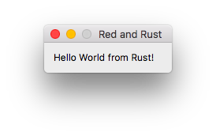

# libred.rs (alpha)

Safe Rust bindings to the library interface of the [Red Programming Language](http://www.red-lang.org/p/about.html).

The goal is to **allow GUI apps to be written in Rust** using libRed.

# Note

This binding is in an a very early alpha stage and is not yet complete.

# Installation

You need to install the Red programming language first before building this library.

Download Red below:

[Red Windows/Mac/Linux](http://www.red-lang.org/p/download.html)

or via Homebrew:

```
brew cask install red
```

Once you have Red installed on your system clone this repo and head to the building section.

# Building

Right now **Red only supports 32-bit** so you need to download a 32-bit toolchain of Rust to get this working. This has been tested to be working on Mac. Windows should work but I have not tested this on Linux yet.

If you have [rustup.rs](https://www.rustup.rs) installed on your system, run:

```
rustup default stable-i686-apple-darwin
```

and once that is your default toolchain, run: 

`cargo run --example=helloworld`

You should get the following example program below:



# Contributing

Contributions are welcome! Fork this repo and add your changes and submit a PR.

If you would like to fix a bug, add a feature or provide feedback you can do so in the issues section.

# License

GPL-3.0+
